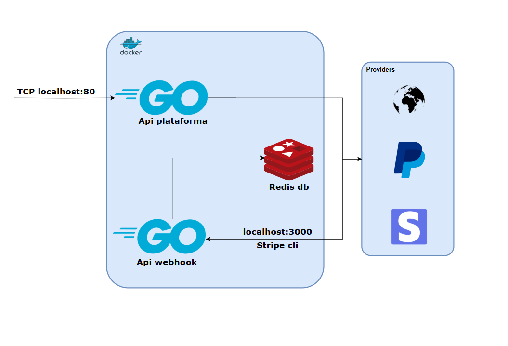

## Multigateway and Multicurrency

This project supports multiple payment gateways and multiple currencies, providing flexibility and convenience for users. With real-time currency conversion and integration with various payment gateways, you can easily manage transactions in different currencies and payment methods.

Key features include:
- Real-time currency conversion.
- Support for multiple payment gateways.
- Seamless integration with Stripe and PayPal.
- Easy configuration and setup.
- Comprehensive API documentation.

These features ensure that your application can handle payments and subscriptions efficiently, regardless of the currency or payment method used.

## Diagram



This diagram illustrates the overall architecture of the Fixed Subscription Demo project, showcasing the interaction between the frontend, backend, and Stripe services.

## API Endpoints

The following routes are available in the backend API:
- `GET /api/v1/currencies` - Returns a list of available currencies.
- `POST /api/v1/currencies/convert` - Converts an amount from one currency to another.
- `GET /api/v1/gateways/available` - Returns a list of available payment gateways.
- `GET /api/v1/gateways/transactions` - Returns a list of transactions for a specific gateway.
- `POST /api/v1/gateways` - Adds a new payment gateway.
- `GET /ping` - Health check endpoint.

## API Webhook Endpoints

The following webhook endpoints are available in the backend API:
- `POST /api/v1/paypal/webhook` - Handles PayPal webhook events.
- `POST /api/v1/stripe/webhook` - Handles Stripe webhook events.

These endpoints are configured to process incoming webhook notifications from PayPal and Stripe, ensuring that your application can respond to events such as payment completions, subscription updates, and more.


## Test Payment Methods

For testing purposes, you can use the following card numbers with their corresponding payment methods:

| Brand               | Number            | CVC          | Date            |
|---------------------|-------------------|--------------|-----------------|
| Visa                | 4242424242424242  | Any 3 digits | Any future date |
| Visa (debit)        | 4000056655665556  | Any 3 digits | Any future date |
| Mastercard          | 5555555555554444  | Any 3 digits | Any future date |
| Mastercard (debit)  | 5200828282828210  | Any 3 digits | Any future date |

These test card numbers can be used to simulate various payment scenarios in a development environment.
		

## Features

- Multi-currency support with real-time conversion.
- Integration with multiple payment gateways.
- Health check endpoint for monitoring service status.
- Docker support for containerized deployment.
- Comprehensive API documentation and examples.
- Easy setup and configuration with environment variables.
- Local development support with Stripe CLI and Ngrok for webhook testing.
- Detailed system architecture diagram for better understanding.
- Extensive error handling and logging for troubleshooting.
- Scalable and maintainable codebase following best practices.
- Open source and community-driven development.

## Prerequisites

- Golang for Backend
- A Stripe account. You can sign up for free [here](https://dashboard.stripe.com/register)
- An Open Exchange Rates account. You can sign up for free [here](https://openexchangerates.org/signup)
- To run the app in a container, you will also need Docker.

- Change variables in `.env.prod` with the credentials to run with Docker.

## Stripe CLI Integration Webhook

1. Install the Stripe CLI globally via apt:
```
sudo apt install stripe
```
You can download Stripe CLI from here: [Download Stripe CLI](https://docs.stripe.com/stripe-cli)

2. Authenticate the Stripe CLI with your Stripe account:
```
stripe login
stripe fixtures seed.json
```

3. Once installed and authenticated, you can use the Stripe CLI to interact with your Stripe account, test webhooks, and more. Here are some common commands:

- Start the Stripe webhook forwarding:
```
stripe listen --events payment_intent.created,payment_intent.succeeded --forward-to localhost:3000/api/v1/stripe/webhook
```
Replace `http://localhost:3000/webhook` with the URL of your webhook endpoint.

- Test a webhook locally:
Use the `stripe trigger` command to trigger a specific webhook event for testing purposes.
```
stripe trigger payment_intent.succeeded
```

- Inspect Stripe events:
Use the `stripe events` command to list recent Stripe events.
```
stripe events list
```

## Configure Stripe Webhook
Ngrok allows you to expose your local server to the internet securely. Follow these steps to install Ngrok:

- Download Ngrok from the official website: [Download Ngrok](https://ngrok.com/download)

### Setup Webhook in Stripe

- Log in to your Stripe Dashboard.
- Navigate to Developers > Webhooks.
- Click on the Add endpoint button.
- Select the events you want to listen to (e.g., payment success, subscription status changes).
- Click Add endpoint to save the webhook configuration.

## How to run with Docker

Follow the steps below to run the `run.sh` script:

1. Ensure you have Docker installed and running on your system. You can download Docker from [here](https://www.docker.com/get-started).

2. Open a terminal and navigate to the root directory of the project.

3. Execute the `run.sh` script:
``` sh
sh run.sh
```

The `run.sh` script will build and start the Docker containers as defined in the `docker-compose.yml` file, setting up the necessary environment for the application to run.

## How to run on Magalu Cloud

1. Create an account on Magalu Cloud [here](https://id.magalu.com/account/signup?protocol=oauth2&response_type=code&client_id=2c547d34-0dd1-11ed-861d-0242ac120002&redirect_uri=https://console.magalu.cloud/api/login/idmagalu&choose_tenants=true&scope=virtual-machine.read%20virtual-machine.write%20block-storage.read%20block-storage.write%20object-storage.read%20object-storage.write%20network.read%20network.write%20api-consulta.read%20pa:allow-lists:read%20pa:payment-methods:read%20pa:clients:create%20mke.read%20mke.write%20dbaas.read%20dbaas.write%20cpo:read%20cpo:write%20usr:tr-sign-terms%20usr:tr-user-data%20usr:tr-sshkey-r%20usr:tr-sshkey-w%20cms:cloud-product-management:read-basic%20pa:tenants:read%20pa:groups:read%20pa:groups:create%20pa:groups:update%20pa:groups:delete%20pa:delegations:read%20pa:delegations:write%20pa:delegations:delete%20pa:api-products:read%20pa:payment-methods:create%20pa:accounts-business:update%20pa:accounts:create%20pa:accounts:update%20pa:scopes:read%20pa:accounts:read%20pa:scopes-approval:update%20pa:payment-methods:update%20usr:user-standing:bucket-read%20bss-customer:read%20bss-customer:write%20pa:cloud-cli:features%20profile%20pa:payment-methods:delete%20usr:user-standing:block-read%20usr:tr-preview-w%20pa:sa:manage)
2. Go to the Magalu Cloud console
3. Create a virtual machine:
    - Navigate to the "Virtual Machines" section.
    - Click on "Create Virtual Machine".
    - Select an ubunto 24.4 LTS
    - Create or use an existing SSH key. You can find the documentation [here](https://docs.magalu.cloud/docs/computing/virtual-machine/how-to/instances/gen-ssh-key-instance/).
    - Enable the firewall with ports 22 (SSH), 80, and 3000 (TCP) in the "Grupo de Segurança Padrão" or create a new "Grupo de Segurança" with these rules.
4. Access ssh with the user and ip informação in your instance virtual machine
    - ```sh

      ssh ubuntu@201.**.*.***

      ```
5. clone the repo
   - ```sh

      git clone https://github.com/CarlosSoaresDev/magalu-cloud-challenge.git

      ```
    - navigate to path: magalu-cloud-challenge
    - ```sh

      cd magalu-cloud-challenge

      ```
    - change secrets using vi
    - ```sh

      vi app/.env.prod

      ```
    - Run shell script to install docker e run container
    - ```sh

      sh run.sh

      ```
6. Configure stripe to send hook to your API
7. Use this [collection](https://github.com/CarlosSoaresDev/magalu-cloud-challenge/tree/master/docs)